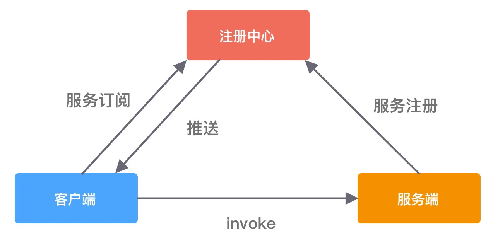
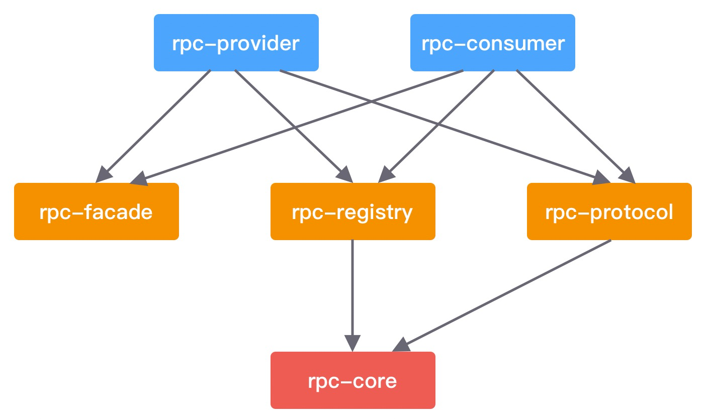

# play-with-rpc

## 项目描述
用 Netty 实现一个简易版的 RPC 框架

## 环境搭建
- 操作系统：Windows 10
- 集成开发工具：IntelliJ IDEA 2020.3
- 项目技术栈：SpringBoot 2.7.1 + JDK 1.8.0_221 + Netty 4.1.42.Final
- 项目依赖管理工具：Maven 3.6.3
- 注册中心：Zookeeeper 3.4.13，需要特别注意 Zookeeeper 和 Apache Curator 一定要搭配使用，Zookeeper 3.4.x 版本，Apache Curator 只有 2.x.x 才能支持

## 项目测试
- 启动 Zookeeper 服务器：zkServer start
- 启动 rpc-provider 模块 RpcProviderApplication
- 启动 rpc-consumer 模块 RpcConsumerApplication
- 测试：浏览器输入 http://localhost:8080/hello，成功返回 hello ===> rpc

## 项目架构


## 模块依赖

- rpc-provider，服务提供者。负责发布 RPC 服务，接收和处理 RPC 请求。
- rpc-consumer，服务消费者。使用动态代理发起 RPC 远程调用，帮助使用者来屏蔽底层网络通信的细节。
- rpc-registry，注册中心模块。提供服务注册、服务发现、负载均衡的基本功能。
- rpc-protocol，网络通信模块。包含 RPC 协议的编解码器、序列化和反序列化工具等。
- rpc-core，基础类库。提供通用的工具类以及模型定义，例如 RPC 请求和响应类、RPC 服务元数据类等。
- rpc-facade，RPC 服务接口。包含服务提供者需要对外暴露的接口，本模块主要用于模拟真实 RPC 调用的测试。

## 注册中心
```java
public interface RegistryService {

    /**
     * 服务注册
     *
     * @param serviceMeta 元数据信息
     * @throws Exception 服务注册异常
     */
    void register(ServiceMeta serviceMeta) throws Exception;

    /**
     * 服务注销
     *
     * @param serviceMeta 元数据信息
     * @throws Exception 服务注销异常
     */
    void unRegister(ServiceMeta serviceMeta) throws Exception;

    /**
     * 服务发现
     *
     * @param serviceName 服务名
     * @param invokerHashCode 调用者hash码
     * @return 服务元数据信息
     * @throws Exception 服务发现异常
     */
    ServiceMeta discovery(String serviceName, int invokerHashCode) throws Exception;

    /**
     * 注册中心销毁
     *
     * @throws IOException 注册中心销毁异常
     */
    void destroy() throws IOException;

}
```

## 负载均衡
```java
public interface ServiceLoadBalancer<T> {

    /**
     * 选择服务实例
     *
     * @param servers 注册中心中，服务实例的元数据信息 List<ServiceInstance<ServiceMeta>>
     * @param hashCode 请求对象参数列表中第一个参数的 hashCode
     * @return 选中后的服务实例
     */
    T select(List<T> servers, int hashCode);

}
```

默认提供了一致性 Hash 算法实现服务发现功能。

## 通信协议
```properties
+----------------------------------------------------------------+
| 魔数 2byte | 协议版本号 1byte | 序列化算法 1byte | 报文类型 1byte |
+----------------------------------------------------------------+
| 状态 1byte |        消息 ID 8byte     |      数据长度 4byte      |
+----------------------------------------------------------------+
|                   数据内容 （长度不定）                          |
+----------------------------------------------------------------+
```
